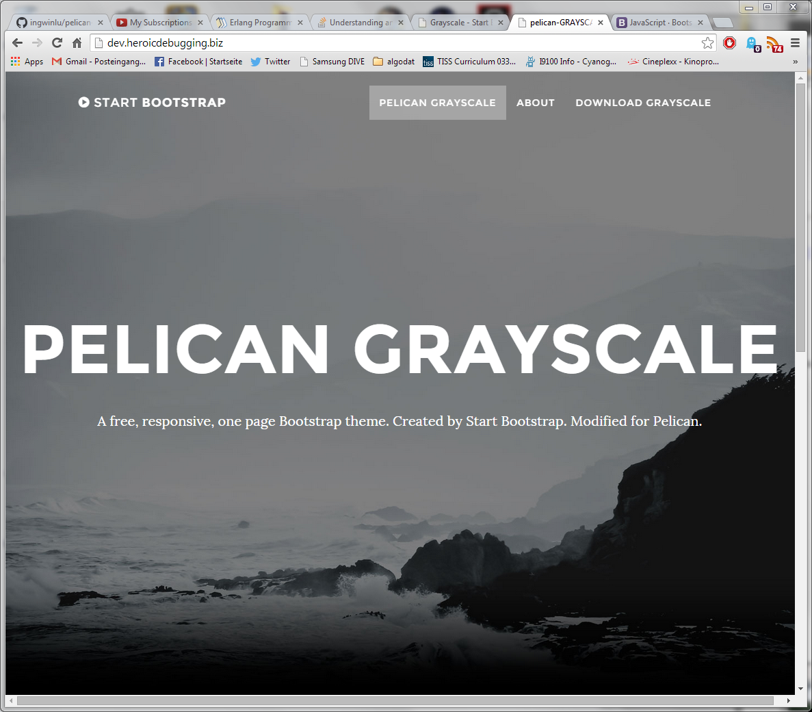

pelican-GRAYSCALE
===================

pelican theme that mimics [grayscale]. 

This is a **sideproject** of mine and might not be completed, looking for improvements on how to add css stuff for each page.


###config
must use with a config similar to `EXAMPLE/sample_pelicanconf.py`.

###pages
A page represents a `section` of the single page. The following metadata is needed:
```
Title: Pelican GRAYSCALE
sortorder: 0
section: intro
```
See the `EXAMPLE` folder for more details.

###live
[live]
###preview



[grayscale]: http://startbootstrap.com/templates/grayscale/  "GRAYSCALE"
[live]: http://dev.heroicdebugging.biz/ "GRAYSCALE DEV"
